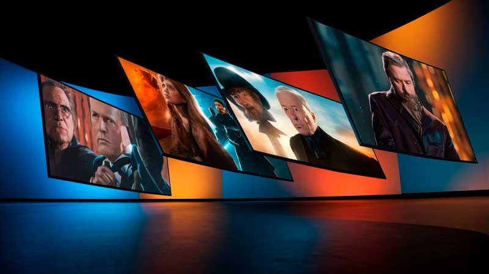

# Como Usar a Inteligência Artificial para Criar Imagens Perfeitas

A criação de imagens perfeitas nunca foi tão acessível quanto hoje, graças à Inteligência Artificial (IA). De designers profissionais a amadores, a IA está transformando a forma como imagens são produzidas, oferecendo ferramentas que combinam rapidez, qualidade e criatividade. Neste artigo, exploraremos como utilizar a IA para criar imagens impressionantes e como plataformas como o Total Gen estão liderando essa revolução.

<!-- truncate -->

## O Que é a Criação de Imagens com IA?

A criação de imagens com IA utiliza algoritmos avançados para gerar visuais a partir de descrições textuais ou ajustes personalizados em imagens existentes. Esses sistemas aprendem a partir de bancos de dados gigantescos e, com isso, são capazes de produzir obras de arte digitais, designs comerciais ou até mesmo ilustrações específicas para projetos pessoais.

Ferramentas como DALL-E e Stable Diffusion, disponíveis no Total Gen, exemplificam essa tecnologia. Elas interpretam entradas textuais, conhecidas como prompts, e transformam palavras em imagens detalhadas, únicas e de alta qualidade.

## Benefícios de Usar a IA para Criar Imagens

A IA na criação de imagens oferece uma série de vantagens para criadores e empresas:

1. **Economia de Tempo e Recursos**

Criar imagens do zero pode ser um processo demorado e caro, especialmente se depender de fotógrafos ou ilustradores. A IA simplifica esse processo, gerando imagens em segundos e eliminando a necessidade de contratar profissionais para tarefas simples.

2. **Acessibilidade para Não Especialistas**

Mesmo sem habilidades avançadas em design gráfico, qualquer pessoa pode criar imagens incríveis com ferramentas de IA. Basta descrever o que você deseja, e a tecnologia fará o resto.

3. **Personalização Total**

A IA permite criar imagens altamente personalizadas, ajustando estilos, cores, formatos e até mesmo detalhes específicos para atender às necessidades de cada projeto.

4. **Variedade de Estilos**

Seja uma arte abstrata, um retrato realista ou um design futurista, a IA oferece uma ampla gama de estilos para explorar, garantindo que cada projeto tenha uma identidade visual única.

5. **Qualidade Consistente**

Ao contrário do trabalho humano, que pode variar em qualidade dependendo de fatores como tempo ou inspiração, as ferramentas de IA garantem resultados consistentes em todas as criações.

## Como Funciona a Criação de Imagens com IA?

A criação de imagens com IA envolve etapas simples:

1. **Escolha da Ferramenta**

Existem várias plataformas de IA para criação de imagens. O Total Gen é uma excelente opção, oferecendo acesso a ferramentas poderosas como DALL-E e Stable Diffusion.

2. **Definição do Prompt**

Um prompt é a descrição textual que informa à IA o que você deseja criar. Quanto mais detalhado e claro for o seu prompt, melhor será o resultado. Por exemplo, "Um pôr do sol em uma praia tropical com cores vibrantes" gera uma imagem bem diferente de "Uma ilustração minimalista de um pôr do sol em preto e branco".

3. **Ajustes e Refinamentos**

Após a geração da imagem, muitas ferramentas permitem ajustes adicionais, como mudar cores, adicionar elementos ou aplicar diferentes estilos artísticos.

4. **Download e Uso**

Depois de finalizar sua criação, basta fazer o download e usar a imagem em seus projetos, seja para blogs, redes sociais, campanhas publicitárias ou impressões.

## Dicas para Criar Imagens Perfeitas com IA

Embora a IA facilite o processo, algumas estratégias podem melhorar ainda mais os resultados:

1. **Seja Detalhista no Prompt**

Um prompt detalhado ajuda a IA a entender exatamente o que você deseja. Por exemplo, em vez de "Um carro em uma estrada", experimente "Um carro esportivo vermelho em uma estrada sinuosa, com montanhas ao fundo, ao entardecer".

2. **Experimente Diferentes Estilos**

Explore as opções de estilos disponíveis, como realista, cartoon, vintage ou futurista. Testar diferentes abordagens pode levar a descobertas visuais interessantes.

3. **Use Palavras-Chave Relevantes**

Inclua palavras-chave que descrevam elementos visuais específicos, como cores, iluminação ou texturas. Isso ajuda a IA a alinhar os resultados com sua visão criativa.

4. **Ajuste as Imagens Geradas**

Ferramentas como o Estúdio de Foto do Total Gen permitem refinar as imagens após a geração. Isso é útil para corrigir pequenos detalhes ou personalizar ainda mais o visual.

5. **Combine Recursos**

Para projetos mais complexos, combine imagens geradas por IA com outras ferramentas, como editores gráficos, para adicionar camadas extras de personalização.

## Aplicações da IA na Criação de Imagens

A criação de imagens com IA é incrivelmente versátil e pode ser aplicada em diversos contextos:

1. **Design Gráfico**

Empresas utilizam IA para criar logotipos, banners, postagens para redes sociais e outros materiais promocionais de maneira rápida e econômica.

2. **Arte Digital**

Artistas exploram a IA como uma ferramenta criativa, gerando conceitos iniciais ou obras completas que misturam arte tradicional e tecnologia.

3. **Marketing e Publicidade**

Imagens de alta qualidade são essenciais para atrair a atenção do público. A IA permite criar visuais impactantes que elevam campanhas de marketing a novos patamares.

4. **Educação e Treinamento**

Professores e instrutores podem usar a IA para criar materiais visuais, como ilustrações ou gráficos informativos, que tornam o aprendizado mais envolvente.

5. **Conteúdo para Blogs e Sites**

Imagens criadas com IA enriquecem artigos, tornando-os mais atrativos e otimizados para SEO. Por exemplo, um blog sobre viagens pode usar a IA para gerar imagens exclusivas de destinos turísticos.

## Por Que Escolher o Total Gen?

O Total Gen é uma plataforma que reúne as melhores ferramentas de IA em um só lugar, facilitando a criação de imagens e muito mais. Entre os principais recursos oferecidos estão:

- **DALL-E e Stable Diffusion**: Geração de imagens de alta qualidade a partir de texto.
- **Editor Inteligente**: Ajuste e personalização de imagens.
- **Estúdio de Foto**: Edição avançada para refinar criações.
- **Flux e outras ferramentas exclusivas**: Para atender às necessidades específicas de design.

Com uma interface amigável e recursos abrangentes, o Total Gen é ideal tanto para iniciantes quanto para profissionais que buscam agilidade e resultados consistentes.

## Desafios e Limitações da IA na Criação de Imagens

Embora a IA seja uma ferramenta poderosa, ela tem algumas limitações:

- **Dependência de Prompts de Qualidade**: Um prompt mal formulado pode resultar em imagens que não atendem às expectativas.
- **Falta de Controle Criativo Fino**: Algumas ferramentas não oferecem controle completo sobre detalhes específicos.
- **Questões Éticas e Direitos Autorais**: Certifique-se de que as imagens geradas estejam livres de violações de direitos autorais e sejam usadas de forma ética.

## O Futuro da Criação de Imagens com IA

O futuro promete avanços ainda mais surpreendentes, incluindo:

- **IA Colaborativa**: Ferramentas que permitem interações mais fluidas entre humanos e máquinas para co-criação.
- **Realidade Aumentada e Virtual**: Imagens geradas por IA que se integram perfeitamente a ambientes digitais imersivos.
- **Customização em Tempo Real**: Ajustes instantâneos em imagens durante sua criação.

## Conclusão

A Inteligência Artificial está transformando a forma como criamos imagens, democratizando o acesso a ferramentas avançadas de design e oferecendo possibilidades criativas ilimitadas. Com plataformas como o Total Gen, qualquer pessoa pode produzir imagens perfeitas para uma ampla gama de aplicações, de blogs a campanhas publicitárias.

Seja você um designer experiente ou um iniciante curioso, explorar as ferramentas de IA para criação de imagens é um passo essencial para elevar seus projetos ao próximo nível. Experimente hoje e descubra como a tecnologia pode revolucionar sua criatividade!