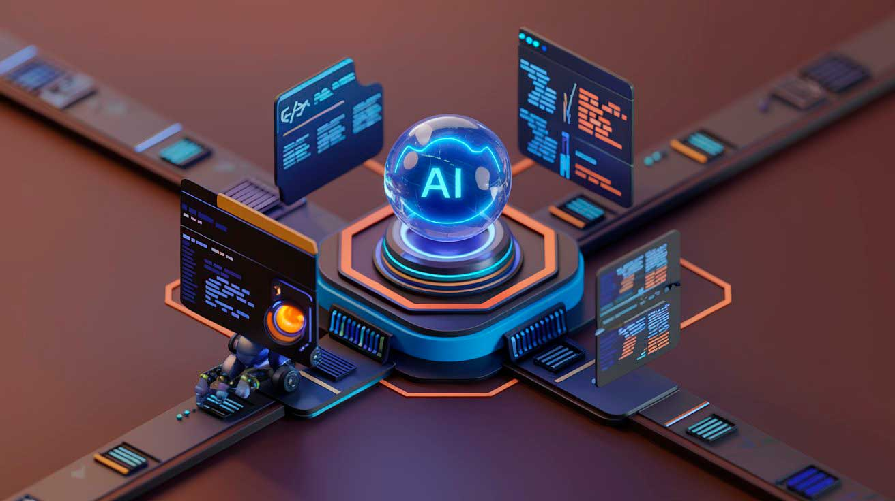

# A Revolução da Produção de Conteúdo com Inteligência Artificial

Nos últimos anos, a Inteligência Artificial (IA) tem transformado diversos setores, e o marketing digital não ficou de fora. A produção de conteúdo para blogs e sites, que antes demandava longas horas de pesquisa, criatividade e redação, agora pode ser feita de maneira mais eficiente e assertiva graças às ferramentas baseadas em IA. Neste artigo, vamos explorar como a IA está revolucionando esse cenário, oferecendo agilidade, personalização e resultados surpreendentes.

## A Evolução da Produção de Conteúdo

Antes do advento da IA, a criação de conteúdo dependia exclusivamente do trabalho humano. Escrever um artigo envolvia etapas complexas: pesquisa detalhada, organização de ideias, produção do texto e revisão. Esse processo, embora eficaz, era limitado pela capacidade humana de criar rapidamente grandes volumes de conteúdo com qualidade consistente.

Com a chegada da IA, novas possibilidades surgiram. Ferramentas inteligentes como o Total Gen oferecem soluções completas que incluem a geração de textos, reescrita de conteúdos, criação de imagens e até narração por IA. Essas tecnologias não apenas aceleram a produção de conteúdo, mas também aumentam a precisão e a relevância, adaptando-se às necessidades específicas do público-alvo.

## Benefícios da IA na Produção de Conteúdo

### 1. Agilidade na Produção

A Inteligência Artificial pode criar artigos em minutos, eliminando o tempo necessário para brainstorms ou bloqueios criativos. Por exemplo, ferramentas como o GPT, disponíveis no Total Gen, geram textos bem estruturados e baseados em informações atualizadas. Isso é especialmente útil para blogs que precisam publicar regularmente para manter a audiência engajada.

### 2. Personalização do Conteúdo

Com a IA, é possível personalizar artigos para diferentes personas de marketing. Analisando dados sobre o comportamento e interesses do público, as ferramentas geram textos que se conectam diretamente com os leitores. Assim, marcas podem entregar conteúdos mais relevantes e aumentar as taxas de conversão.

### 3. Economia de Recursos

Contratar redatores e revisores para criar grandes volumes de conteúdo pode ser caro. A IA reduz significativamente esses custos, permitindo que empresas e criadores de conteúdo otimizem seus investimentos. Além disso, ao automatizar tarefas repetitivas, as equipes podem se concentrar em estratégias mais criativas e analíticas.

### 4. Otimização para SEO

A IA ajuda a identificar e incluir palavras-chave relevantes, melhorar a estrutura dos textos e gerar metadados otimizados. Ferramentas como as oferecidas pelo Total Gen permitem que os artigos sejam facilmente encontrados pelos motores de busca, aumentando a visibilidade orgânica dos blogs e sites.

### 5. Consistência e Qualidade

Manter um padrão de qualidade em todos os conteúdos pode ser desafiador para grandes equipes. A IA garante consistência na linguagem e no tom de voz, criando artigos que refletem a identidade da marca de forma uniforme.

## Casos de Uso da IA na Produção de Conteúdo

A aplicação da IA vai muito além da simples escrita de textos. Aqui estão alguns exemplos de como as ferramentas inteligentes estão sendo utilizadas:

### 1. Ideação e Planejamento de Conteúdo

Ferramentas de IA analisam tendências e dados de busca para sugerir temas relevantes para o seu nicho. Isso facilita o planejamento editorial, garantindo que os blogs abordem assuntos de interesse do público.

### 2. Produção de Artigos Longos e Detalhados

Modelos de linguagem avançados, como o GPT-4, geram artigos longos, bem estruturados e com informações detalhadas. Isso é especialmente útil para conteúdos educativos ou informativos.

### 3. Reescrita e Parafraseamento

A IA pode reescrever textos existentes para ajustá-los a diferentes contextos ou melhorar a clareza. Essa funcionalidade é ideal para reutilizar conteúdos de sucesso em diferentes canais.

### 4. Criação de Imagens e Elementos Visuais

Blogs que combinam textos com imagens impactantes têm maior engajamento. Ferramentas como o DALL-E, integradas ao Total Gen, permitem criar imagens personalizadas a partir de descrições textuais, enriquecendo o apelo visual dos artigos.

### 5. Geração de Títulos e Metadados

Um bom título é crucial para atrair cliques. A IA pode gerar títulos cativantes e meta-descrições otimizadas, aumentando as chances de os artigos serem encontrados no Google.

## Desafios e Limitações da IA na Produção de Conteúdo

Apesar de suas vantagens, a IA também apresenta desafios. Ela pode gerar textos tecnicamente corretos, mas que carecem de empatia ou emoção. Além disso, sem supervisão humana, há o risco de informações imprecisas ou descontextualizadas serem incluídas nos artigos.

Para evitar esses problemas, é fundamental combinar o uso da IA com a revisão humana. A criatividade e a sensibilidade de um redator experiente são insubstituíveis quando se trata de contar histórias envolventes ou criar conexões emocionais com o público.

## O Futuro da Produção de Conteúdo com IA

O futuro da produção de conteúdo com IA promete inovações ainda mais surpreendentes. Algumas tendências incluem:

- **IA Colaborativa:** Ferramentas que permitem interação mais fluida entre humanos e máquinas, facilitando o refinamento de textos e ideias.
- **Conteúdo Multimodal:** Criação simultânea de textos, imagens e vídeos para campanhas integradas.
- **Análise Preditiva:** Uso de IA para prever quais tipos de conteúdo terão maior impacto em diferentes públicos.
- **Tradução e Localização:** Facilitar a criação de conteúdos globais adaptados a diferentes idiomas e culturas.

## Conclusão

A Inteligência Artificial está revolucionando a forma como blogs e sites produzem conteúdo. Ferramentas como as disponíveis no Total Gen permitem não apenas criar textos de alta qualidade, mas também otimizar processos, reduzir custos e personalizar conteúdos para diferentes públicos.

No entanto, é importante lembrar que a IA deve ser usada como uma aliada, não como um substituto total para o trabalho humano. A combinação de tecnologia avançada e supervisão criativa resulta em conteúdos poderosos e impactantes.

Se você deseja explorar o potencial da IA na criação de conteúdos, visite o Total Gen e descubra como essa plataforma pode transformar seu processo de produção de forma prática e eficiente.